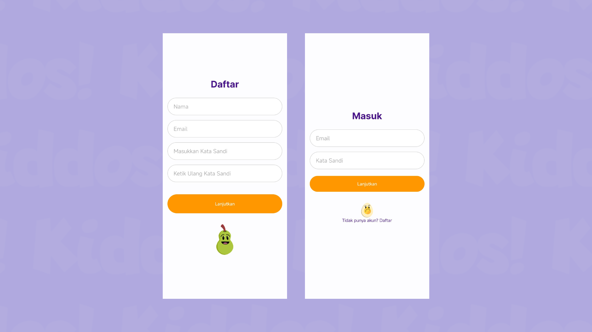
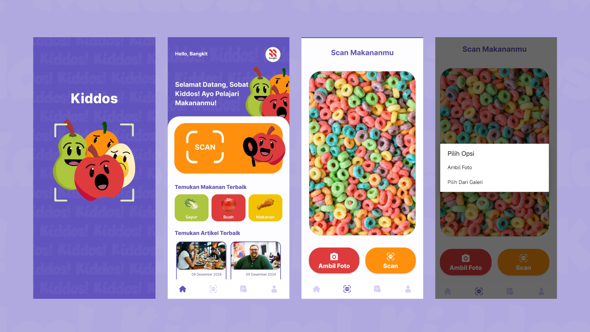
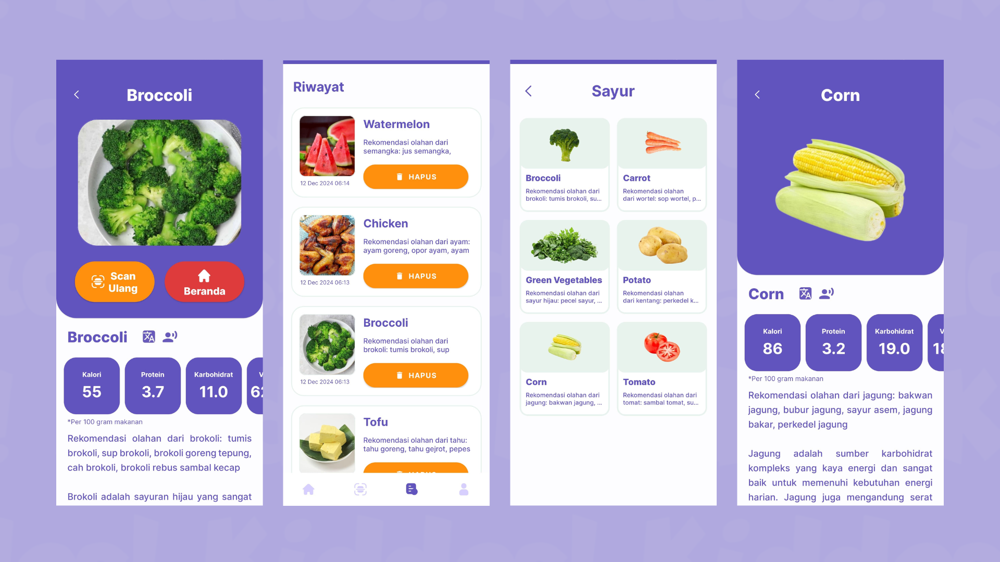
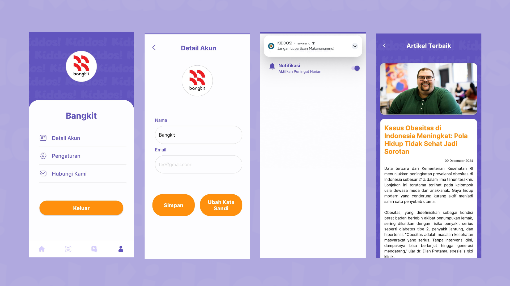

# Kiddos (Kids' Food Discoveries)

Kiddos (Kids' Food Discoveries) is an educational application specifically designed for children and parents. This application aims to enhance children's understanding of food in an interactive and enjoyable way. Its main features include the ability to scan food using the device's camera or upload a photo from the internal gallery, translate food names into various languages with a text-to-speech feature, and provide detailed nutritional information about the scanned food, along with recommended meal ideas that can be prepared based on the scanned food results. 

## Deployment Link APK Kiddos (Kids' Food Discoveries)

Download Link APK Kiddos :<br>
[Kiddos APK (Google Drive)](https://drive.google.com/drive/folders/1scZkxsurEgijRSIcD1fI7QOuoQeL5wVM?hl=ID)

## Features
- [x] Sign Up
- [x] Sign In
- [x] Food Scan
- [x] Scan History
- [x] Bottom Navigation
- [x] Translation of Food Names
- [x] Text to Speech
- [x] Food Information (Temukan Makanan Terbaik Feature)
- [x] Relevant Articles about Food (Temukan Artikel Terbaik Feature)
- [x] Profile
      
## Screenshots
<p align="center">
  
</p>
<p align="center">
  
</p>
<p align="center">
  
</p>
<p align="center">
  
</p>

## UI/UX Design
- Link Prototype Design : [Prototype](https://www.figma.com/design/XAnos1WdKJqdFJHntiaVnq/Kiddos-UI---Bangkit?node-id=0-1&t=tzLYClI9wyiYcg0U-1)

  
## Requirement
* Android Studio Koala
* Android Device or Android Emulator with minimum SDK 24
* (Opsional) USB Cable (to Connect Android Device to your Computer)

## Installation

### 1. Clone this Project to your Computer
```bash
git clone https://github.com/Kiddos-Kids-Food-Discoveries/Kiddos-Android.git
```
and wait until it finish downloaded.

### 2. Open the Project in your Android Studio
Open Android Studio and select open an existing project, next open the project which you have cloned.

### 3. Run Project in Android Studio
Wait for Gradle Build to Finish and finally press the `Run > Run ‘app’`. Now the app has been installed in your phone / emulator. Make sure that you have configured your android device or emulator.

## Languages and Tools:
<p align="left"> <a href="https://developer.android.com" target="_blank" rel="noreferrer">  </a> <a href="https://www.docker.com/" target="_blank" rel="noreferrer">  </a> <a href="https://www.figma.com/" target="_blank" rel="noreferrer">  </a> <a href="https://firebase.google.com/" target="_blank" rel="noreferrer">  </a>  <a href="https://cloud.google.com" target="_blank" rel="noreferrer">  </a> <a href="https://git-scm.com/" target="_blank" rel="noreferrer">  </a> <a href="https://developer.mozilla.org/en-US/docs/Web/JavaScript" target="_blank" rel="noreferrer">  </a> <a href="https://kotlinlang.org" target="_blank" rel="noreferrer">  </a> <a href="https://postman.com" target="_blank" rel="noreferrer">  </a> <a href="https://www.python.org" target="_blank" rel="noreferrer">  </a> <a href="https://www.tensorflow.org" target="_blank" rel="noreferrer">  </a> <a href="https://fastapi.tiangolo.com" target="_blank" rel="noreferrer">  </a> <a href="https://hapi.dev" target="_blank" rel="noreferrer">  </a> </p>

###

🔥 Supported By

###

<div align="center">
  
  
  
</div>

###
